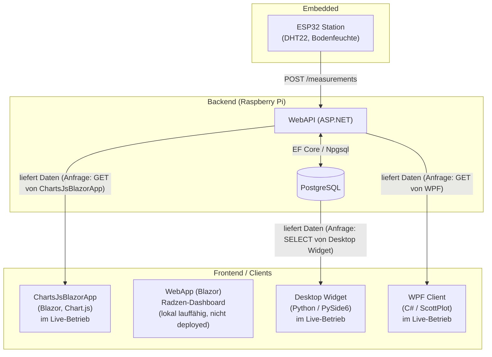

# PlantStation

PlantStation ist ein Full-Stack-IoT-Projekt zur Überwachung von Pflanzen: ESP32-Sensorstationen messen Temperatur, Luftfeuchtigkeit, Bodenfeuchtigkeit und Wasserstand und senden die Daten an eine zentrale ASP.NET-Core-API, die auf einem Raspberry Pi läuft. Die Messwerte werden persistiert (PostgreSQL) und über mehrere Clients (Web, Desktop) visualisiert.

Das Projekt ist mein persönliches Langzeitprojekt, an dem ich seit 2025 arbeite. Der Fokus meiner Arbeit liegt auf dem Backend; Embedded- und Client-Entwicklung vertiefe ich im Rahmen des Projekts kontinuierlich weiter.

## Architektur



Drei Clients (ChartsJsBlazorApp, Desktop Widget, WPF Client) sind aktiv im Einsatz und decken jeweils eine eigene Plattform ab: ChartsJsBlazorApp für den Browser, Desktop Widget für Linux, WPF Client für Windows. `WebApp` (Radzen-Dashboard) ist lokal lauffähig, wird aber aktuell nicht auf dem Raspberry Pi deployt.

## Tech Stack

| Bereich        | Technologien |
|----------------|--------------|
| **Backend**    | ASP.NET Core Web API, Entity Framework Core, Npgsql (PostgreSQL), Serilog, Repository-Pattern, xUnit |
| **Frontend**   | Blazor (Server + WebAssembly Hybrid), Radzen Components |
| **Desktop**    | Python, PySide6 (Qt), SQLAlchemy, pandas, matplotlib |
| **Embedded**   | ESP32 (Arduino Framework, PlatformIO), DHT22, kapazitiver Bodenfeuchtesensor, Wasserstandssensor |
| **Infra**      | Raspberry Pi als API-/DB-Host, dyndns für externen Zugriff |

## Projektstruktur

| Ordner | Beschreibung |
|---|---|
| `WebAPI` | ASP.NET Core Web API – nimmt Messwerte der Sensorstationen entgegen und stellt sie den Clients bereit. Läuft produktiv auf dem Raspberry Pi. |
| `DataAccess` | EF-Core-Modelle, `ApiContext` und Repositories (Stations, Sensors, Measurements, Plants, ...) nach Repository-Pattern. |
| `DataAccessUnitTest` | Unit-Tests für die Repository- und Validierungslogik (xUnit). |
| `LoggingService` | Kapselung von Serilog hinter einem Interface (`ILoggingService`) für austauschbares Logging. |
| `ConverterService` | Konvertierung zwischen Entities und DTOs. |
| `PlantStationHelperService` | Kleine fachliche Hilfsfunktionen (u. a. Median-/Mittelwertberechnung). |
| `WebApp` | Blazor-Dashboard (Server + WASM Hybrid, Radzen) – lokal lauffähig, aktuell nicht auf dem Pi deployt (kein Eintrag in `deploy.sh`, keine passende Backend-URL-Konfiguration hinterlegt). |
| `ChartsJsBlazorApp` | Blazor-Frontend mit Chart.js – das tatsächlich produktiv über `deploy.sh`/systemd (`blazor-app.service`) deployte Web-Frontend, erreichbar unter der eigenen Domain. |
| `PlantStationDesktopWidget` | Python/PySide6-Desktop-App, greift direkt per SQLAlchemy auf die Datenbank zu und stellt Messwerte je Station/Sensor mit matplotlib dar. Aktiv im Einsatz. |
| `WPFClient` | Desktop-Client für Windows (WPF, ScottPlot) – aktiv im Einsatz, neben WebApp (Browser) und Desktop Widget (Linux) einer von drei gleichwertigen Clients. |
| `Embedded` | Firmware für die ESP32-Sensorstationen (PlatformIO): Sensor-Auslesung, Kalibrierung, Versand der Messwerte an die API. |
| `Sensors` | Datenblätter der verwendeten Sensoren (DHT22, Hygrometer, Wasserstandssensor). |

## Screenshots

**WebApp – Dashboard (Blazor/Radzen)**
Auswahl von Station, Sensor und Zeitspanne, Anzeige des Temperaturverlaufs. Lokal lauffähig, aktuell nicht auf dem Pi deployt.


**Desktop Widget (Python/PySide6)**
Übersicht je Station und Sensor mit Zeitraum-Auswahl sowie Min-/Max-/Mittelwert-/Median-Statistik.


## Backend-Highlights

- **Repository-Pattern** mit klar getrennten Interfaces (`IMeasurementRepo`, `IStationRepo`, ...) für Testbarkeit und Austauschbarkeit.
- **52 Unit-Tests** allein für die Measurement-Repository- und Validierungslogik.
- **Validierungsservice** für Messwerte, der physikalisch unmögliche Werte (z. B. -41 °C oder 601 °C) erkennt und markiert, statt sie unbemerkt in die Datenbank zu übernehmen.
- **Kalibrierung auf Embedded-Seite**: eigene ADC-Kalibrierungslogik und Median-Berechnung, um verrauschte Sensordaten (Bodenfeuchte) zu glätten, bevor sie an die API gesendet werden.
- Sensible Zugangsdaten (Connection Strings, WLAN-/API-Zugangsdaten für die ESP32-Firmware) werden über `secrets.h.example`-Vorlagen bzw. Platzhalter-Konfiguration gehandhabt und nicht im Klartext versioniert.

## Setup / Lokales Ausführen

1. PostgreSQL-Datenbank anlegen.
2. Connection String hinterlegen – **nicht** in `appsettings.json` committen, sondern per [.NET User Secrets](https://learn.microsoft.com/aspnet/core/security/app-secrets) setzen:
   ```bash
   cd WebAPI
   dotnet user-secrets set "ConnectionString:MyDb" "Host=localhost;Database=plantstation;Username=...;Password=..."
   ```
   (Achtung: Der Schlüssel heißt `ConnectionString`, ohne "s" am Ende – muss exakt so lauten, wie er im Code über `builder.Configuration["ConnectionString:MyDb"]` gelesen wird.)
3. Datenbankschema anlegen: `dotnet ef database update --project DataAccess --startup-project WebAPI`
4. `WebAPI` starten: `dotnet run --project WebAPI` (läuft standardmäßig auf `http://localhost:5000`).
5. `ChartsJsBlazorApp` starten: `dotnet run --project ChartsJsBlazorApp`. Die Backend-URL wird über den Konfigurationswert `BackendUrl` gesetzt (Standard in `appsettings.json`: interne Netzwerk-IP des Raspberry Pi – für lokale Entwicklung auf `http://localhost:5000/` anpassen).
6. Für die Embedded-Firmware: `Embedded/src/secrets.h.example` nach `secrets.h` kopieren und WLAN-/API-Zugangsdaten eintragen, dann per PlatformIO auf den ESP32 flashen.

> Hinweis: `WebApp` (Radzen-Dashboard) ist ebenfalls per `dotnet run --project WebApp` startbar, hat aber aktuell keine funktionierende Backend-URL-Konfiguration hinterlegt und müsste dafür zunächst entsprechend ergänzt werden.

## Ausblick

- Umstellung der Kommunikation zwischen ESP32-Stationen und Backend von HTTP/REST auf MQTT
- Steuerung der Bewässerung (nicht nur Messung, sondern aktives Gießen)
- Messung und Steuerung von Nährstoffwerten (Düngen)
- Vereinheitlichung der Frontends (Chart.js-Ansatz aus `ChartsJsBlazorApp` evtl. in `WebApp` integrieren)