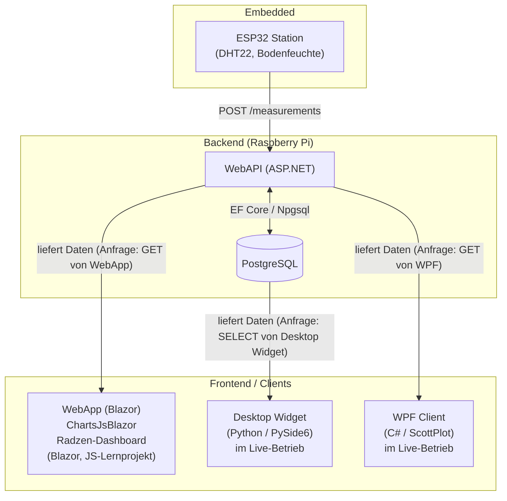
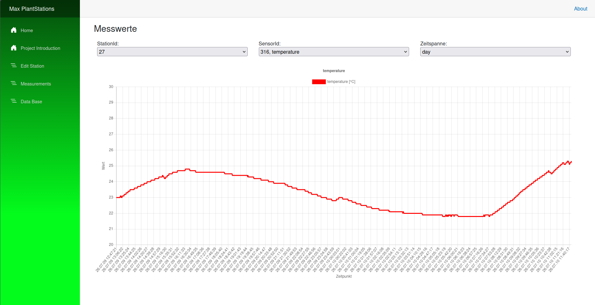
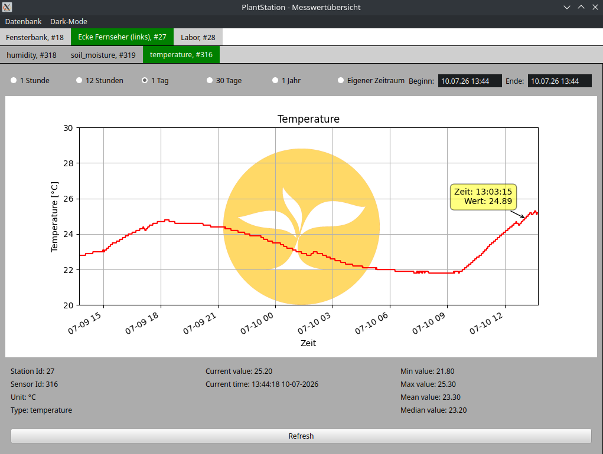

# PlantStation

PlantStation ist ein Full-Stack-IoT-Projekt zur Überwachung von Pflanzen: ESP32-Sensorstationen messen Temperatur, Luftfeuchtigkeit, Bodenfeuchtigkeit und Wasserstand und senden die Daten an eine zentrale ASP.NET-Core-API, die auf einem Raspberry Pi läuft. Die Messwerte werden persistiert (PostgreSQL) und über mehrere Clients (Web, Desktop) visualisiert.

Das Projekt ist mein persönliches Langzeitprojekt, an dem ich seit [ZEITRAUM EINFÜGEN] arbeite. Der Fokus meiner Arbeit liegt auf dem Backend; Embedded- und Client-Entwicklung vertiefe ich im Rahmen des Projekts kontinuierlich weiter.

## Architektur

Alle drei Clients (WebApp, Desktop Widget, WPF Client) sind aktiv im Einsatz und decken jeweils eine eigene Plattform ab: WebApp für den Browser, Desktop Widget für Linux, WPF Client für Windows.

## Tech Stack

| Bereich        | Technologien |
|----------------|--------------|
| **Backend**    | ASP.NET Core Web API, Entity Framework Core, Npgsql (PostgreSQL), Serilog, Repository-Pattern, xUnit |
| **Frontend**   | Blazor (Server + WebAssembly Hybrid), Radzen Components |
| **Desktop**    | Python, PySide6 (Qt), SQLAlchemy, pandas, matplotlib |
| **Embedded**   | ESP32 (Arduino Framework, PlatformIO), DHT22, kapazitiver Bodenfeuchtesensor, Wasserstandssensor |
| **Infra**      | Raspberry Pi als API-/DB-Host, dyndns für externen Zugriff |

## Projektstruktur

| Ordner | Beschreibung |
|---|---|
| `WebAPI` | ASP.NET Core Web API – nimmt Messwerte der Sensorstationen entgegen und stellt sie den Clients bereit. Läuft produktiv auf dem Raspberry Pi. |
| `DataAccess` | EF-Core-Modelle, `ApiContext` und Repositories (Stations, Sensors, Measurements, Plants, ...) nach Repository-Pattern. |
| `DataAccessUnitTest` | Unit-Tests für die Repository- und Validierungslogik (xUnit). |
| `LoggingService` | Kapselung von Serilog hinter einem Interface (`ILoggingService`) für austauschbares Logging. |
| `ConverterService` | Konvertierung zwischen Entities und DTOs. |
| `PlantStationHelperService` | Kleine fachliche Hilfsfunktionen (u. a. Median-/Mittelwertberechnung). |
| `WebApp` | Blazor-Dashboard (Server + WASM Hybrid, Radzen) – das aktiv genutzte Web-Frontend zur Anzeige der Messwerte. |
| `ChartsJsBlazorApp` | Zweites Blazor-Frontend mit Chart.js – entstanden, um mich in JavaScript/Chart.js einzuarbeiten; aktuell kein produktiver Client, sondern Spielwiese für eine mögliche zukünftige Variante. |
| `PlantStationDesktopWidget` | Python/PySide6-Desktop-App, greift direkt per SQLAlchemy auf die Datenbank zu und stellt Messwerte je Station/Sensor mit matplotlib dar. Aktiv im Einsatz. |
| `WPFClient` | Desktop-Client für Windows (WPF, ScottPlot) – aktiv im Einsatz, neben WebApp (Browser) und Desktop Widget (Linux) einer von drei gleichwertigen Clients. |
| `Embedded` | Firmware für die ESP32-Sensorstationen (PlatformIO): Sensor-Auslesung, Kalibrierung, Versand der Messwerte an die API. |
| `Sensors` | Datenblätter der verwendeten Sensoren (DHT22, Hygrometer, Wasserstandssensor). |

## Screenshots

**WebApp – Live-Dashboard (Blazor/Radzen)**
Auswahl von Station, Sensor und Zeitspanne, Anzeige des Temperaturverlaufs.

**Desktop Widget (Python/PySide6)**
Übersicht je Station und Sensor mit Zeitraum-Auswahl sowie Min-/Max-/Mittelwert-/Median-Statistik.

## Backend-Highlights

- **Repository-Pattern** mit klar getrennten Interfaces (`IMeasurementRepo`, `IStationRepo`, ...) für Testbarkeit und Austauschbarkeit.
- **52 Unit-Tests** allein für die Measurement-Repository- und Validierungslogik.
- **Validierungsservice** für Messwerte, der physikalisch unmögliche Werte (z. B. -41 °C oder 601 °C) erkennt und markiert, statt sie unbemerkt in die Datenbank zu übernehmen.
- **Kalibrierung auf Embedded-Seite**: eigene ADC-Kalibrierungslogik und Median-Berechnung, um verrauschte Sensordaten (Bodenfeuchte) zu glätten, bevor sie an die API gesendet werden.
- Sensible Zugangsdaten (Connection Strings, WLAN-/API-Zugangsdaten für die ESP32-Firmware) werden über `secrets.h.example`-Vorlagen bzw. Platzhalter-Konfiguration gehandhabt und nicht im Klartext versioniert.

## Setup / Lokales Ausführen

> [HIER ergänzen: kurze Schritt-für-Schritt-Anleitung, z. B.]
1. PostgreSQL-Datenbank anlegen und Connection String in `WebAPI/appsettings.json` eintragen.
2. `WebAPI` starten: `dotnet run --project WebAPI`.
3. `WebApp` starten: `dotnet run --project WebApp` (API-URL ggf. in `appsettings.json` anpassen).
4. Für die Embedded-Firmware: `Embedded/src/secrets.h.example` nach `secrets.h` kopieren und WLAN-/API-Zugangsdaten eintragen, dann per PlatformIO auf den ESP32 flashen.

## Ausblick

- Vereinheitlichung der Frontends (Chart.js-Ansatz aus `ChartsJsBlazorApp` evtl. in `WebApp` integrieren)
- [WEITERE IDEEN, die du hast, hier ergänzen]
